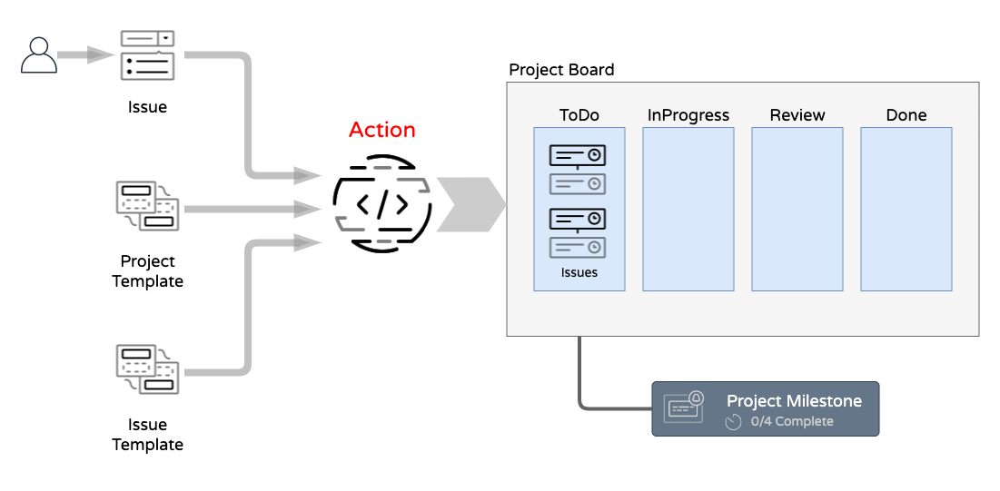

# project-template-action

GitHub action to create Project Boards from template Yaml files.

This **Action** creates a **Project Board with pre-polulated Issues**, based on **Issue-Templates**.

---

## Overview 



---

## Action Workflow Example

Location: `.github/workflows/action.yml`

```Yaml
name: project-template-action

on:
  issues:
    types: [opened, edited]
  issue_comment:
    types: [created,edited]

jobs:
  test:
    runs-on: ubuntu-latest
    steps:
      - uses: actions/checkout@v2
      - run: npm install @octokit/action
      - uses: jefeish/project-template-action@v1
        with:
          GITHUB_TOKEN: ${{ secrets.SECRET_PAT }}
```

---

## Issue *Trigger-Command*

to trigger an automated project board setup based on templates, place a `/slash` command in an Issue comment or body. 

### Sample

```bash
/project prj-template-a
```

---

## Project Template Sample

Location: `.github/PROJECT_TEMPLATE/prj-template-a.yml`

```Yaml
---
Projects:
  - name: Project_1
    description: Test Project 
    columns:
      # Project Board Column  
      - name: ToDo
        manage: none
        cards:
          - name: Issue_1
            type: Issue
            template: bug
          - name: Issue_2
            type: Issue
            template: task
      # Project Board Column  
      - name: InProgress
        manage: none
        cards:
          - name: Issue_1
            type: Card
            template: bug
          - name: Issue_2
            type: Card
            template: task
      # Project Board Column  
      - name: Done
        manage: none

```


