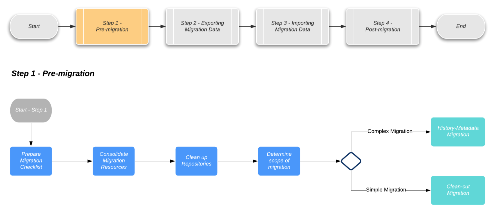
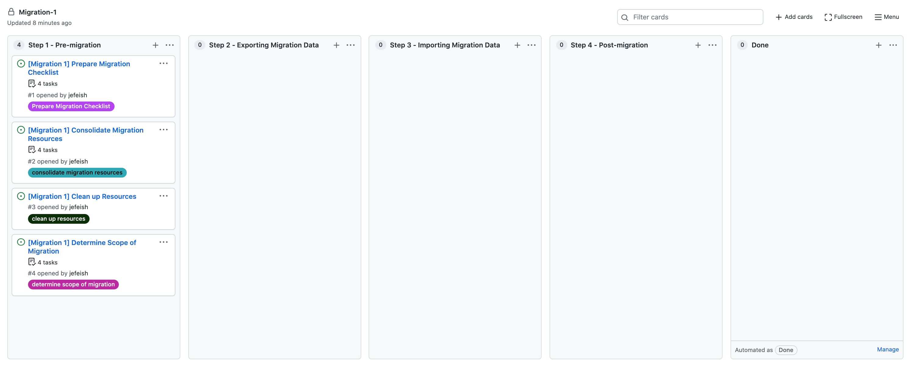
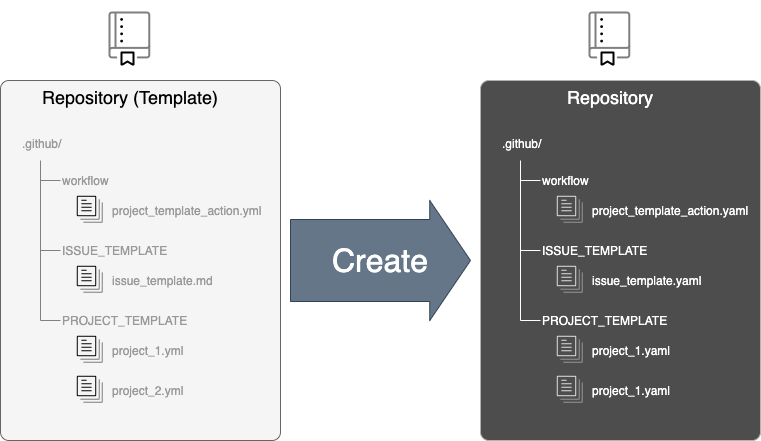

# A GitHub Action to enable Project Board `templating`

Create Project Boards and Project Cards completely from Yaml templates!

> Note: This solution uses GitHub Actions.

---

# Why did we make this ?

Lets imagine you start working on a new solution and
these are the usual tasks...

- create a Repo,
- add some code,
- add some documentation :crossed_fingers:
- and to top it off, apply CI/CD! :tada:

Now as soon as your solution becomes more popular you start using Issues for collaboration and **`project boards to coordinate and manage`** the collaboration. :thumbsup:

So to make this work, what tools do we have... ?

- For Repos, we have Repo templates
- For Issues, we have Issue Templates
- For Projects, we have ... :thinking: ?

...you get the point ?! :)

Project Boards can describe a `Process` or even a `Playbook` (not ansible :grin:).

We can reuse that!

>BUT: If you create the Project "by hand" it's tough to reuse it! :shrug:

---

# What can you use it for ?

Anything that benefits from some project management or planning !
## A migration example 

Imagen a Project Board for [GitHub migrations](https://github.github.io/enterprise-migrations/#/./0-about), listing all the admistrative `steps required to manage a migration`!

Here are some of our guideline steps for a migration



To provide some context to that picture. 

- The `"top-level"` items (Step1-4, grey boxes) are the major migration steps.
- The `Blue-boxes` (*'Prepare Migration Checklist'*, *'Consolidate Migration Resources'*, etc.) are the detailed tasks for each Step.

To map this to GitHub components:

- The `Migration` is a `Project Board`
- The `Steps` are `Project Columns`
- The `Blue-boxes` are `Issues`

### At a starting point it could look something like this 



### Let's have a template for that, and use it!

We will show you the template details in a moment

### TODO: DEMO THE CREATION OF MULTIPLE PROJECT BOARDS

---

# How did we do it ?

## Everything is based on Teamplates !

First we make sure that we have all the required templates, we do that by using a Repo Template that contains all the other Templates.
> Note: A `Migration Repo` is what we use to keep track of all the migration activities. It usually contains only project info and tasks, no code.

### Here is an overview



### To automate and share the Project Boards we turned it into an **`As Code`** solution!

We use a GitHub Action together with a **`Project Board Template`** Yaml file!

**This is what the template Yaml looks like**

```yaml
---
projects:
  - name: Migration 1
    description: Migration Project 1 
    # Milestone due date - example format '2022-11-10T00:00:00Z'
    duedate: '2022-11-10T00:00:00Z'
    columns:

      - name: Step 1 - Pre-migration
        manage: none
        cards:
          - name: Issue_prepare-migration-checklist
            type: Issue
            template: Issue_prepare-migration-checklist
            parameters:
              ASSIGNEES: jefeish
              TITLE: Migration 1
          - name: Issue_consolidate-migration-resources
            type: Issue
            template: Issue_consolidate-migration-resources
            parameters:
              ASSIGNEES: jefeish
              TITLE: Migration 1
          - name: Issue_cleanup-resources
            type: Issue
            template: Issue_cleanup-resources
            parameters:
              ASSIGNEES: jdoe
              TITLE: Migration 1
          - name: Issue_determine-scope-of-migration
            type: Issue
            template: Issue_determine-scope-of-migration
            parameters:
              ASSIGNEES: jdoe
              TITLE: Migration 1      

      - name: Step 2 - Exporting Migration Data
        manage: none

      - name: Step 3 - Importing Migration Data
        manage: none

      - name: Step 4 - Post-migration
        manage: none

      - name: Done
        manage: none
```

As you can see, **`the Template supports input parameters`** to customize the content.

### We now can share and reuse these templates, fast and often!

---

### And that concludes our short demonstration of `Project Board Templates` ... Thank you! 

---

# Appendix

GitHub Action Reference: https://github.com/jefeish/project-template-action
